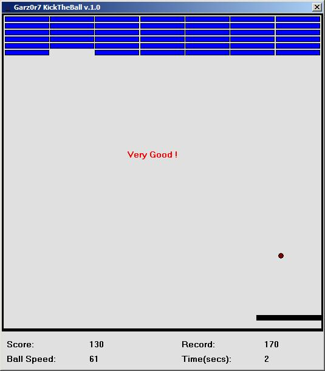



## Kick The Ball v\.2\.0

### Description

It's an Arkanoid-style game written in visual basic.

Addictive and simple..PLEASE VOTE IT.
 
### More Info
 

             |
---                |---
**Submitted On**   |2006-07-11 15:09:22
**By**             |[garz0r7](https://github.com/Planet-Source-Code/PSCIndex/blob/master/ByAuthor/garz0r7.md)
**Level**          |Beginner
**User Rating**    |4.7 (14 globes from 3 users)
**Compatibility**  |VB 6\.0
**Category**       |[Games](https://github.com/Planet-Source-Code/PSCIndex/blob/master/ByCategory/games__1-38.md)
**World**          |[Visual Basic](https://github.com/Planet-Source-Code/PSCIndex/blob/master/ByWorld/visual-basic.md)
**Archive File**   |[Kick\_The\_B2005857122006\.zip](https://github.com/Planet-Source-Code/garz0r7-kick-the-ball-v-2-0__1-65922/archive/master.zip)

